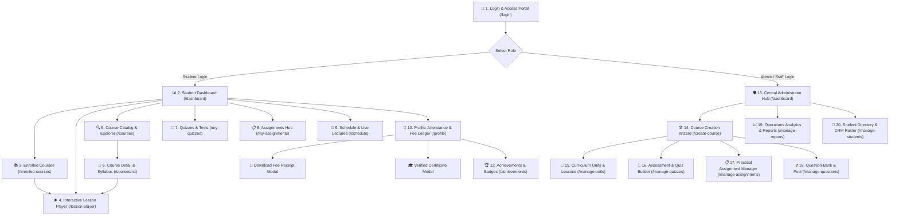

# Operating Media LMS — Complete Website Flow & Feature Guide

Welcome to the comprehensive walkthrough of the **Operating Media Learning Management System (LMS)**. This document provides an easy-to-read, visual guide detailing every page of the web application, explaining **how each page works**, **what key value it gives the user**, and **how all pages connect into an intuitive flow**.

---

## 🗺️ High-Level Website Flow Diagram

The platform is designed around two streamlined journeys: the **Student Learning Flow** and the **Administrator Management & Course Authoring Engine**.

---

## 1. Login & Access Portal

**Route**: `/login`  
**Purpose**: Secure entry point for students, staff, and instructors.

### What this page gives the user:
* **One-Click Role Switching**: Switch seamlessly between **Student Mode** (e.g., *Hiteshpuri Goswami*) and **Administrator Mode** for live platform demonstrations and stakeholder reviews.
* **Branded Login Portal**: Clean Operating Media logo, secure password fields, and credentials management.
* **Direct Access**: Instantly directs authenticated students straight into their personalized dashboard.

---

## 2. Student Learning Dashboard

**Route**: `/dashboard` (Student Mode)  
**Purpose**: The central command center for student learning, tracking progress, and immediate next steps.

### What this page gives the student:
1. **Personalized Welcome Banner**: Displays student photo avatar, full name, Student ID (`OMC-0265`), Branch Center (*Borivali Center*), and enrolled curriculum program (*Diploma in Digital Marketing*).
2. **4 Real-Time KPI Stat Cards**:
   * **Overall Progress (65%)**: Circular gauge tracking total course milestones.
   * **Active Courses (4)**: Total enrolled subjects.
   * **Average Quiz Score (88.5%)**: Cumulative grade metric.
   * **Upcoming Lectures (2)**: Classes and tests scheduled for today and tomorrow.
3. **Continue Learning Card**:
   * Current active lesson: *Lesson 2.2: Schema Markup & Structured Data Implementation*.
   * Progress Bar integrated inside the information column with 65% complete.
   * 65% Complete donut chart, next lesson preview box, and a prominent **Resume Lesson button**.
4. **Quick Actions Hub**: Quick-jump shortcuts to *Browse Courses*, *My Quizzes*, and *Assignments*.
5. **Today / Upcoming Schedule**: Real-time listing of aptitude tests and live doubt-clearing sessions with colorful date badges.
6. **Milestone Banner**: Motivational achievement tracker celebrating study consistency.

---

## 3. Enrolled Courses Workspace

**Route**: `/enrolled-courses`  
**Purpose**: Dedicated space for students to review all courses they are currently attending.

### What this page gives the student:
* **Active Course Cards**: Clean cards for each course (*SEO & Technical Optimization*, *Social Media Marketing*, *Google Ads & PPC*, *Website Development*).
* **Progress Tracking**: Clear visual progress percentages (e.g., 65%, 40%, 100%) and unit breakdown (*12/18 Units Completed*).
* **Resume Button**: Direct one-click access to jump back into where the student left off.

---

## 4. Interactive Video Classroom & Lesson Player

**Route**: `/lesson-player?courseId=course-8`  
**Purpose**: The hands-on learning environment where students watch lectures and study course materials.

### What this page gives the student:
* **High-Definition Video Player**: Video lecture controls, speed toggles, and auto-play to the next lesson.
* **Curriculum Sidebar**: Complete modular index (Module 1, Module 2, Module 3) with checkmarks showing completed lessons.
* **Lesson Resources & Notes**: Downloadable cheatsheets, PDF guides, code snippets, and instructor references.
* **Next / Previous Navigation**: Step seamlessly forward and backward through course modules.

---

## 5. Course Catalog & Directory

**Route**: `/courses`  
**Purpose**: Full directory of diploma tracks, advanced certifications, and masterclasses available at Operating Media.

### What this page gives the user:
* **Search & Filters**: Search by keyword or filter by category (*SEO*, *Google Ads*, *Analytics*, *Social Media*, *Web Development*).
* **Course Highlights**: Duration, level (*Beginner*, *Intermediate*, *Advanced*), number of lectures, and verified certificate badge.
* **Quick Enrollment**: Allows students and counselors to view curriculum syllabi and enroll in new modules.

---

## 6. Course Detail & Syllabus Breakdown

**Route**: `/courses/:id` (e.g., `/courses/course-8`)  
**Purpose**: Comprehensive syllabus breakdown, learning objectives, and batch schedules for a specific course.

### What this page gives the user:
* **Deep Syllabus Overview**: Full chapter-by-chapter outline of what will be taught.
* **Instructor Information**: Bio and industry credentials of the faculty lead.
* **Prerequisites & Certification**: Certification requirements, exam details, and career readiness outcomes.

---

## 7. Quizzes & Assessments Portal

**Route**: `/my-quizzes`  
**Purpose**: Interactive testing room for chapter quizzes, aptitude evaluations, and mock industry exams.

### What this page gives the student:
* **Assessment List**: Pending and completed quizzes with due dates and time limits (e.g., *20 mins*, *30 mins*).
* **Score Records**: Instant grade calculation with percentage badges and pass/fail indicators.
* **Retake & Review**: Review incorrect answers and retake practice quizzes to improve scores.

---

## 8. Assignments & Homework Submission

**Route**: `/my-assignments`  
**Purpose**: Hands-on project submission area for real-world client briefs and agency case studies.

### What this page gives the student:
* **Task Guidelines**: Clear project briefs (e.g., *Build an SEO Schema Markup*, *Create a Google Ads Search Campaign*).
* **File Uploader**: Drag-and-drop submission for PDF audits, Excel sheets, and design files.
* **Grading Feedback**: Written feedback and review scores from the faculty reviewer.

---

## 9. Class Timetable & Live Lectures Schedule

**Route**: `/schedule`  
**Purpose**: Master calendar for live lectures, classroom batches, and 1-on-1 doubt clearing sessions.

### What this page gives the student:
* **Monthly & Weekly Timetable**: Clean calendar visualization of class times.
* **Live Session Links**: Direct access buttons to join live online lectures via Google Meet / Zoom.
* **Branch / Batch Filter**: Filter by *Borivali Center*, *Andheri Center*, or *Online Evening Batch*.

---

## 10. Student Profile & CRM Financial Records

**Route**: `/profile`  
**Purpose**: Comprehensive student profile combining personal information, verified attendance, tuition fees ledger, and official credentials.

### What this page gives the student:
1. **Student Credentials Card**: Full Name, Email, Contact Number, Student ID (`OMC-0265`), Center (`Borivali`), and Enrolled Track.
2. **CRM Attendance Ledger**: Real-time biometric/class attendance percentage (`89.3%`), total attended lectures (`42/47`), and status badge (*Eligible for Final Exam*).
3. **Tuition Fees Financial Record**:
   * **Total Course Fee**: ₹45,000
   * **Paid to Date**: ₹30,000
   * **Outstanding Balance**: ₹15,000
   * **Next Due Date**: Clearly highlighted with alert tags.
4. **Interactive Action Modals**: Direct buttons to preview the **Official Fee Receipt** and **Verified Diploma Certificate**.

---

## 11. Official Modals & Documents

These modals are directly accessible from the **Student Profile** and **Achievements** pages.

### A. Official Fee Receipt Modal
**Trigger**: Click **"Download Official Receipt"** on the Profile page.

* **Official Branding**: Header logo, institute address, and GST registration number.
* **Itemized Ledger**: Student admission number, course name, transaction ID, payment mode (*UPI/Card*), and breakdown of base fee + 18% GST.
* **Verification & Print**: Official authorized stamp, digital signature, and immediate **"Print / Download PDF"** button.

### B. Verified Digital Diploma Certificate
**Trigger**: Click **"View Verified Certificate"** on the Profile or Achievements page.

* **Industry-Standard Diploma**: High-resolution certificate awarded in *Advanced Digital Marketing Excellence*.
* **Authenticity QR Code**: Unique certificate ID with tamper-proof QR code verification for employer background checks.

---

## 12. Verified Achievements & Badges

**Route**: `/achievements`  
**Purpose**: Gamified learning badges and completed milestones earned by the student.

### What this page gives the student:
* **Trophy Badges**: Visual rewards for *Perfect Attendance*, *Top Quiz Scorer*, *Quick Learner*, and *Module Mastery*.
* **LinkedIn Sharing**: Quick-share links to post verified credentials to LinkedIn profiles.

---

## 13. Central Administrator Hub & Analytics

**Route**: `/dashboard` (Admin Mode)  
**Purpose**: Executive dashboard for branch directors, administrators, and counselor leads.

### What this page gives the administrator:
* **Executive KPIs**: Total Enrolled Students (1,480+), Active Batches (24), Course Tracks (12), Total Fee Collection (₹48.2L).
* **Live CRM Sync Indicator**: Continuous real-time synchronization with institute CRM databases.
* **Categorized Analytics**: Visual charts for monthly enrollment trends, course popularity, and pass rates.
* **Quick Admin Operations**: Direct shortcuts to *Create Course Tracks*, *Manage Units*, *Manage Quizzes*, *Manage Assignments*, and *Export Financial Reports*.

---

## 14. Course Creation Wizard (Step-by-Step Builder)

**Route**: `/create-course`  
**Purpose**: The central curriculum authoring engine allowing administrators and instructors to build, configure, and publish new courses.

### What this page gives the administrator:
* **Step 1: Course Info & Media Setup**:
  * Set Course Category (*Digital Marketing*, *SEO*, *Social Media*, *Web Development*), Course Title, and Short About Summary.
  * Upload promotional video trailer (YouTube/Vimeo/MP4) and high-resolution course banners.
* **Rich-Text Curriculum Editor**: Full WYSIWYG editor for drafting comprehensive course learning objectives, weekly milestones, and prerequisite skillsets.
* **Batch Capacity & Scheduling Controls**: Configure maximum seat limits (e.g. 30 seats per center), duration tags (*Unlimited Duration*, *3 Months*), cohort start dates, and automated evaluation toggles.
* **Structured 4-Step Progression**: Steps seamlessly through *Basic Details*, *Course Settings*, *Curriculum Components Linking*, and *Live Catalog Publishing*.

---

## 15. Curriculum Units & Lesson Management

**Route**: `/manage-units`  
**Purpose**: Granular curriculum management for creating chapters, lesson units, video lectures, and lecture attachments.

### What this page gives the administrator:
* **Course Selection & Hierarchy**: Filter by any course track to inspect its unit breakdown (*Unit 1*, *Unit 2*, *Unit 3*).
* **Lesson Asset Attachment**: Attach video lecture links, downloadable PDF study guides, presentation slides, and code templates to specific lessons.
* **Prerequisite & Drip Rules**: Define unlock criteria (e.g. students must complete Unit 1 before accessing Unit 2).
* **Sequence Reordering**: Quickly drag and reorder units and chapters to keep syllabus tracks up to date.

---

## 16. Assessment & Quiz Builder

**Route**: `/manage-quizzes`  
**Purpose**: Testing management suite for designing chapter quizzes, aptitude evaluations, and final certification examinations.

### What this page gives the administrator:
* **Quiz Parameter Setup**: Assign quiz title, associated course, passing percentage (e.g., 70%), and time countdown duration.
* **Dynamic Question Pool Assignment**: Link questions directly from the central Question Bank or compose custom assessment items.
* **Exam Integrity Controls**: Configure retake limits, question randomization/shuffling, and instant scoring automation.

---

## 17. Practical Assignment & Project Manager

**Route**: `/manage-assignments`  
**Purpose**: Administrative hub for deploying practical coursework, real-world agency briefs, and reviewing student submissions.

### What this page gives the administrator:
* **Assignment Brief Designer**: Create detailed project briefs (e.g., *Conduct an On-Page SEO Audit*, *Build a Google Search Ads Campaign*).
* **Deadlines & Rubrics**: Set explicit submission due dates, total passing marks, and evaluation rubrics.
* **Grading Queue & Feedback**: Access submitted student files, assign numerical marks, and dispatch personalized critiques directly to student dashboards.

---

## 18. Central Question Bank & Question Pool

**Route**: `/manage-questions`  
**Purpose**: Centralized repository of reusable evaluation questions across all digital marketing disciplines.

### What this page gives the administrator:
* **Categorized Question Repository**: Tag and organize questions by specialization (*SEO*, *Google Ads*, *Analytics*, *Social Media*) and difficulty level (*Beginner*, *Intermediate*, *Advanced*).
* **Multiple Evaluation Formats**: Supports Single Choice, Multiple Choice, True/False, and Scenario-Based evaluation items.
* **Question Discussion Forum Moderation**: Connects with `/question-discussions` to review, answer, and moderate student Q&A discussions on tricky concepts.

---

## 19. Operations Analytics & Academic Reports

**Route**: `/manage-reports`  
**Purpose**: Comprehensive business intelligence portal for institute directors, branch managers, and financial accountants.

### What this page gives the administrator:
* **Batch Completion Tracking**: Real-time completion rates across physical centers (*Borivali*, *Andheri*) and online evening batches.
* **Grade & Assessment Distribution**: Visual analytics mapping student pass rates, average quiz scores, and assignment submission frequency.
* **Tuition Fee Revenue Audits**: Summarizes total fee collections, pending installment balances, and center-by-center financial metrics.
* **Audit-Ready Data Export**: Instant export to CSV, Excel, and PDF formats for academic reviews and board meetings.

---

## 20. Student Directory & CRM Roster

**Route**: `/manage-students`  
**Purpose**: Master student administration directory for tracking enrollment status, fee collection, and attendance records.

### What this page gives the administrator:
* **Comprehensive Student Roster**: Searchable, filterable list of all students across Mumbai centers (*Andheri*, *Borivali*, *Online*).
* **Status Badges**: Instant visibility into Fee Status (*Paid*, *Partial*, *Overdue*) and Attendance health (*Good*, *Warning*).
* **Direct Actions**: Ability to update student contact details, issue fee reminders, and approve certification issuance.

---

## 📊 Summary Matrix: All 20 Pages at a Glance

| # | Page / Feature | Primary Route | Target User | Key Value Delivered |
|---|---|---|---|---|
| **1** | **Login & Access Portal** | `/login` | All Users | Role-based authentication, one-click demo login |
| **2** | **Student Dashboard** | `/dashboard` | Student | 4 KPI cards, Continue Learning card, upcoming schedule, quick actions |
| **3** | **Enrolled Courses** | `/enrolled-courses` | Student | Active courses overview, progress percentages, quick resume |
| **4** | **Interactive Lesson Player** | `/lesson-player` | Student | HD video classroom, syllabus sidebar, notes, lesson navigation |
| **5** | **Course Catalog** | `/courses` | Student / Guest | Full course exploration, category filters, curriculum highlights |
| **6** | **Course Detail** | `/courses/:id` | Student / Guest | In-depth module syllabus, faculty profile, batch timing details |
| **7** | **Quizzes & Tests** | `/my-quizzes` | Student | Time-bound exams, aptitude tests, instant grading and review |
| **8** | **Assignments Hub** | `/my-assignments` | Student | Practical agency briefs, project submission, instructor grading |
| **9** | **Class Schedule** | `/schedule` | Student | Weekly timetable, live lecture Google Meet links, batch calendar |
| **10** | **Profile & CRM Ledger** | `/profile` | Student | Personal info, biometric attendance, tuition fee ledger, receipt trigger |
| **11** | **Fee Receipt & Diploma** | Modals on `/profile` | Student / Accounts | GST-compliant printable fee receipt and verified diploma with QR code |
| **12** | **Achievements & Badges** | `/achievements` | Student | Digital credentials, badges, certificate downloads, social sharing |
| **13** | **Admin Central Hub** | `/dashboard` (Admin) | Administrator | Executive KPIs, live CRM sync indicator, batch performance charts |
| **14** | **Course Creation Wizard** | `/create-course` | Administrator | 4-step course builder, rich text editor, promo video, capacity settings |
| **15** | **Curriculum & Units** | `/manage-units` | Administrator | Chapter units, lecture media uploads, prerequisite and drip rules |
| **16** | **Assessment & Quiz Builder** | `/manage-quizzes` | Administrator | Quiz creator, pass percentage, time countdown limits, retake rules |
| **17** | **Practical Assignments** | `/manage-assignments` | Administrator | Coursework briefs, submission deadlines, grading queue & critiques |
| **18** | **Central Question Bank** | `/manage-questions` | Administrator | Reusable question pool, difficulty tagging, Q&A discussion forum |
| **19** | **Operations Reports** | `/manage-reports` | Administrator | Batch completion rates, tuition fee collection audits, CSV/PDF export |
| **20** | **Student Directory CRM** | `/manage-students` | Administrator | Master student roster, fee collection statuses, attendance audit |

---

> [!TIP]
> **Client Note**: All 20 pages above are live and interactive in the Operating Media LMS web portal. You can toggle between the **Student View** and the **Administrator View** directly from the top bar or via the Login page.
